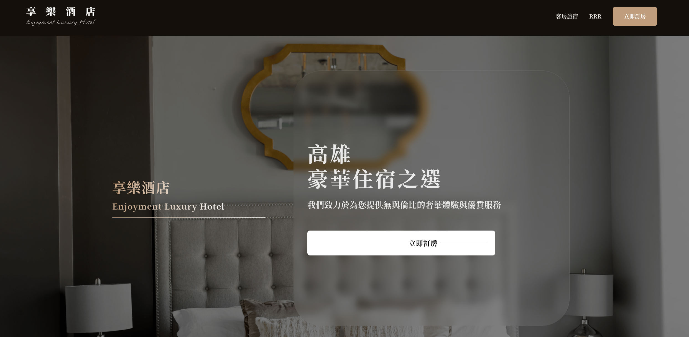
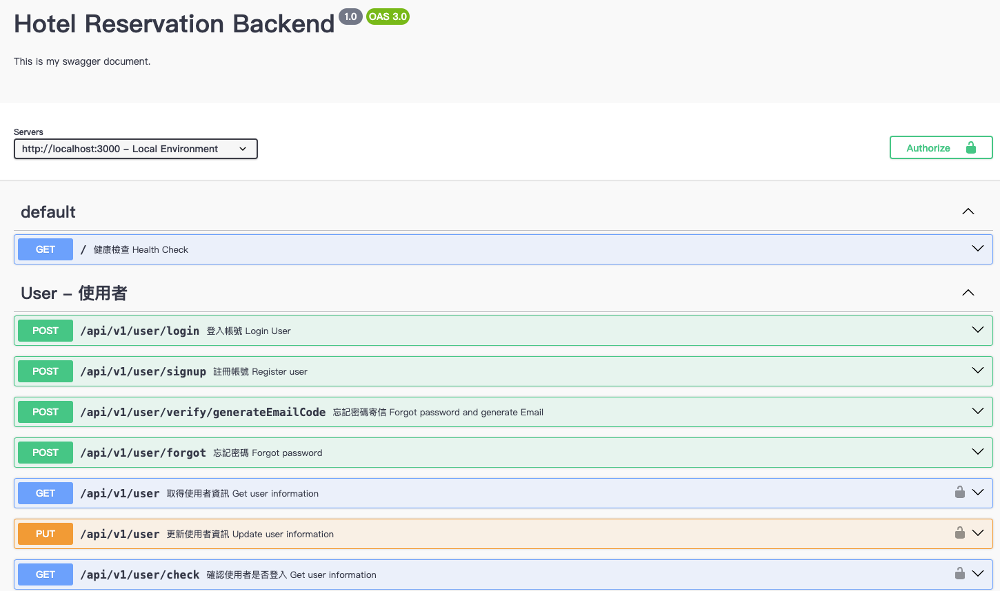

# Hotel Reservation Backend 飯店訂房網站

## Introduction

### Summary


Welcome to our Enjoyment Luxury Hotel booking website, your ideal choice for accommodation!

Here, we offer a variety of featured room types to meet your diverse needs and budget. Whether you're a traveler seeking luxurious indulgence or a budget-conscious guest, we have the perfect room types for you to confidently choose from. Below is an introduction to our carefully curated room categories:

### Features

1. Noble Double Room: This room type offers an incredibly comfortable experience, suitable for couples or business travelers. With spacious surroundings and luxurious amenities, you can unwind and fully enjoy your stay.

2. Economy Double Room: While being more budget-friendly, our Economy Double Room never compromises on comfort and cleanliness. Whether you're a budget traveler or a business commuter, this room type is an excellent choice.

3. Elegant Luxury VVVIP Presidential Suite: For those seeking the utmost luxurious experience, our VVVIP Presidential Suite is designed to meet your desires. The spacious and glamorous room is equipped with top-tier facilities and services, ensuring you experience royal treatment.

4. Homely Paradise: Tailored for families or small groups, this room type provides ample space and convenient amenities, allowing you and your family or friends to enjoy a delightful accommodation experience together.

5. Absolute Insomnia Single Room: Ideal for solo travelers who prefer solitude and need to focus on work or contemplation, our Absolute Insomnia Single Room is the perfect choice. The comfortable environment and convenient facilities allow you to concentrate on work or relax in peace, enjoying moments of tranquility.

<p align='center'>


</p>

In addition, our booking and order management system is extremely convenient and user-friendly. You can easily check room availability and prices online, and make instant reservations. Once your booking is complete, you will receive a confirmation email with details of your order, enabling you to check your order status and manage your accommodation arrangements anytime, anywhere.

Whether you're traveling for business or leisure, we are dedicated to providing you with the highest quality service and the most comfortable accommodation experience. Thank you for choosing us, and we look forward to meeting you on your next journey!

### Swagger


This is a hotel backend service built with NestJS, featuring user login, order management, latest news, delicious dishes, room type management, and including admin functionalities.

This project set up Swagger docs, utilizing the Render service in conjunction with MongoDB. You can refer to the following [URL](https://hotel-reservation-backend-sgtq.onrender.com/api-docs).

If you find this project appealing and decide to give it a GitHub star ⭐️, I would sincerely appreciate your support. Thank you!


## Directory Structure

```txt
└── hotel-reservation-backend
    └── src
        ├── auth
        │   ├── decorators/
        │   ├── guards/
        │   ├── interfaces/
        │   ├── strategies/
        │   ├── auth.modules.ts
        │   └── auth.service.ts
        ├── common
        │   ├── decorator/
        │   └── dto/
        ├── features
        │   ├── culinary/
        │   ├── image/
        │   ├── news/
        │   ├── order/
        │   ├── room/
        │   ├── url/
        │   └── user
        │       ├── dto
        │       ├── interfaces
        │       ├── schemas
        │       ├── user.controller.ts
        │       ├── user.module.ts
        │       └── user.service.ts
        ├── utils
        │   ├── appError.ts
        │   ├── errorHandler.ts
        │   ├── successHandler.ts
        │   └── zipcodes.ts
        ├── app.controller.ts
        ├── app.module.ts
        └── main.ts
```

## How to Run
### Installation

```bash
$ npm install
```

### Running the app

```bash
# development
$ npm run start

# watch mode
$ npm run start:dev

# production mode
$ npm run start:prod
```

### Test

```bash
# unit tests
$ npm run test

# e2e tests
$ npm run test:e2e

# test coverage
$ npm run test:cov
```

## Backend Tech Stack

- NestJs with TypeScript
- Mongo DB
- Render
- Firebase

## Live Demo

<a href="https://rere2133.github.io/ts30_booking_web" target="_blank">Enjoyment Luxury Hotel</a>


## Link
- [Frontend Repo](https://github.com/rere2133/ts30_booking_web)
- [Backend Swagger](https://hotel-reservation-backend-sgtq.onrender.com/api-docs)

## Team Member

1. ColdingPoTaTo (薯餅)
   Responsibilities | Login and Registration functionalities
2. qw050123 (呆呆小將)
   Responsibilities | Member profile management
3. rere2133 (Reckie)
   Responsibilities | Homepage, Room types, Reservation page
4. erik1110 (Erik)
   Backend Development
